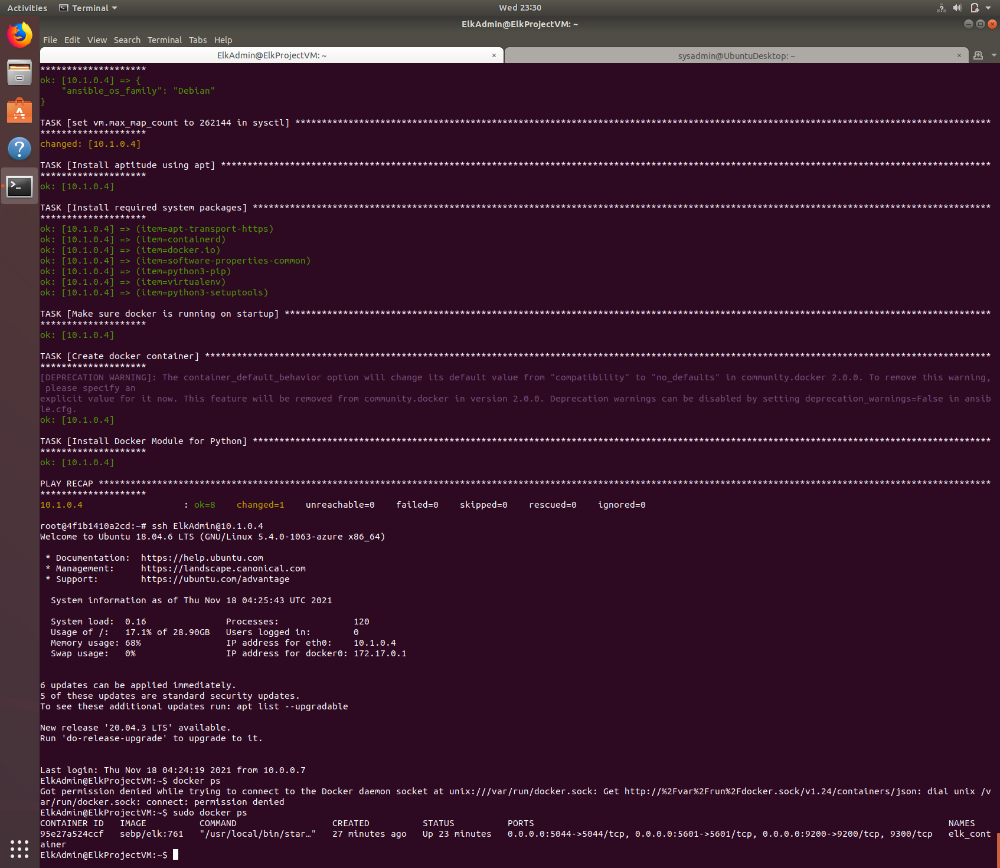

Load balancers are used to increase capacity (concurrent users) and reliability of applications. # Automated ELK Stack Deployment

The files in this repository were used to configure the network depicted below.



These files have been tested and used to generate a live ELK deployment on Azure. They can be used to either recreate the entire deployment pictured above. Alternatively, select portions of the YAML file may be used to install only certain pieces of it, such as Filebeat. 

```
- name: Configure ELK VM with Docker
  hosts: elk
  remote_user: ElKAdmin
  become: true
  vars:
   ansible_python_interpreter: /usr/bin/python3
  tasks:
  - debug:
      var: ansible_os_family

  - name: set vm.max_map_count to 262144 in sysctl
    command: sysctl -w vm.max_map_count=262144

  - name: Install aptitude using apt
    apt: name=aptitude state=latest update_cache=yes force_apt_get=yes

  - name: Install required system packages
    apt: name={{ item }} state=latest update_cache=yes
    loop: [ 'apt-transport-https', 'containerd', 'docker.io', 'python3-pip', 'virtualenv', 'py']

  - name: Make sure docker is running on startup
    systemd:
      state: started
      name: docker

  - name: Create docker container
    docker_container:
       name: elk_container
       image: sebp/elk:761
       state: started
       restart_policy: always
       published_ports:
         - "5601:5601"
         - "9200:9200"
         - "5044:5044"

  - name: Install Docker Module for Python
    pip:
      name: docker
```

This document contains the following details:
- Description of the Topologu
- Access Policies
- ELK Configuration
  - Beats in Use
  - Machines Being Monitored
- How to Use the Ansible Build


### Description of the Topology

The main purpose of this network is to expose a load-balanced and monitored instance of DVWA, the D*mn Vulnerable Web Application.

Load balancing ensures that the application will be highly available, in addition to restricting access to the network.

Load balancers are used to increase capacity (concurrent users) and reliability of applications. 

Jump box provide a segregation layer between the target network and the user.

Integrating an ELK server allows users to easily monitor the vulnerable VMs for changes to the data and system logs.
Filebeat monitors the log files or locations that you specify, collects log events, and forwards them either to Elasticsearch or Logstash for indexing.

Metricbeat takes the metrics and statistics that it collects and ships them to the output that you specify, such as Elasticsearch or Logstash. 

The configuration details of each machine may be found below.
_Note: Use the [Markdown Table Generator](http://www.tablesgenerator.com/markdown_tables) to add/remove values from the table_.

| Name     | Function | IP Address | Operating System |
|----------|----------|------------|------------------|
| Jump Box | Gateway  | 10.0.0.1   |  Linux           |
| Web-1    | Server   | 10.0.0.5   |  Linux           |
| Web-2    | Server   | 10.0.0.6   |  Linux           |
|ElkProjectVM| Monitoring|10.1.0.4 |  Linux           |

### Access Policies

The machines on the internal network are not exposed to the public Internet. 

Only the Jump box machine can accept connections from the Internet. Access to this machine is only allowed from the following IP addresses:
Whitelisted IP addresses_10.0.0.7

Machines within the network can only be accessed by jump box.
JumpBox 40.86.6.200

A summary of the access policies in place can be found in the table below.

| Name     | Publicly Accessible | Allowed IP Addresses |
|----------|---------------------|----------------------|
| Jump Box | Yes                 | 10.0.0.7             |
| Web-1,Web-2|   NO              | 10.0.0.5, 10.0.0.6   |
| ElkProjectVM|  NO              | 10.1.0.4             |

### Elk Configuration

Ansible was used to automate configuration of the ELK machine. No configuration was performed manually, which is advantageous because...
It is very simple to set up and use

The playbook implements the following tasks:
- Installed docker.io and python3-pip packages using Ansible apt module
- Increase virtual memory
- Pulled seep/elk:761 docker container using Ansible docker_container module
- Installed docker module for python using Ansible pip module
- Published the ports "5601:5601", "9200:9200" and "5044:5044" 

The following screenshot displays the result of running `docker ps` after successfully configuring the ELK instance.


### Target Machines & Beats
This ELK server is configured to monitor the following machines:
10.1.0.4

We have installed the following Beats on these machines:
Filebeat and MetricBeat

These Beats allow us to collect the following information from each machine:
Filebeat Collects log events which are used for indexing. 

MetricBeat collects Metric and statistics which are shipped to the output you specify. 

### Using the Playbook
In order to use the playbook, you will need to have an Ansible control node already configured. Assuming you have such a control node provisioned: 

SSH into the control node and follow the steps below:
- Copy the playbook file to Ansible Control Node.
- Update the hosts file to include elk and web server
- Run Ansible playbook on the target machine using 
- Navigate to http://[Host IP]/app/kibana#/home) to check if the Kibana installation was successful
